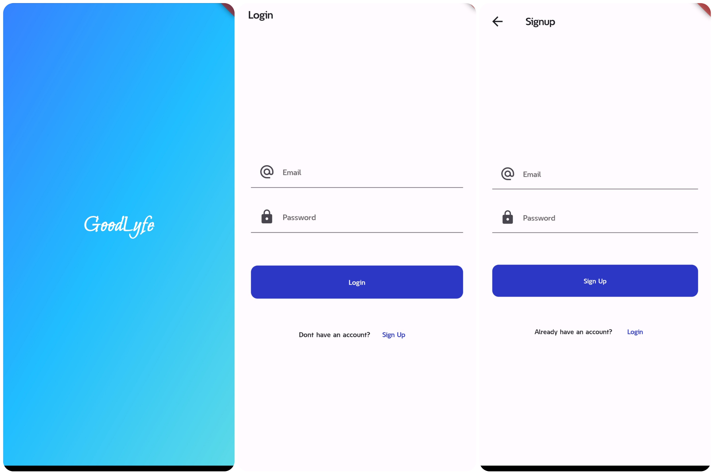
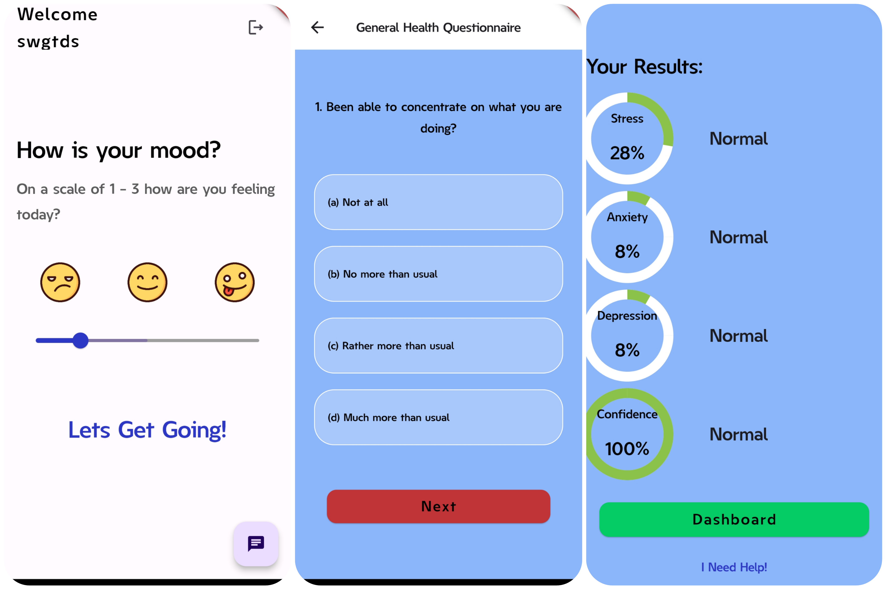

# GoodLyfe

Welcome to the GoodLyfe repository! This Flutter app is designed to help users self-identify their mental health status using established psychiatric tools and questionnaires. Our goal is to provide a user-friendly platform for mental health awareness and early intervention.

## Features

- **Comprehensive Assessments:** Utilizes renowned tools such as GHQ-12 (General Health Questionnaire), ISI (Insomnia Severity Index), and DASS-21 (Depression Anxiety Stress Scales).
- **User-Friendly Interface:** Intuitive design to ensure ease of use for individuals of all backgrounds.
- **Personalized Feedback:** Immediate results and guidance based on your responses.
- **Secure and Confidential:** Ensures user privacy and data security.

## Why Use GoodLyfe?

- Early identification of potential mental health issues.
- Provides insights and resources to seek professional help if needed.
- Encourages mental health awareness and self-care.

## Screenshots





## Getting Started

Follow these instructions to get a copy of the project up and running on your local machine for development and testing purposes.

### Prerequisites

- Flutter SDK: [Install Flutter](https://flutter.dev/docs/get-started/install)
- Git: [Install Git](https://git-scm.com/book/en/v2/Getting-Started-Installing-Git)

### Installation

1. Clone the repository:
   ```sh
   git clone https://github.com/your-repo/goodlyfe
2. Navigate to the project directory:
  ```sh
  cd goodlyfe

